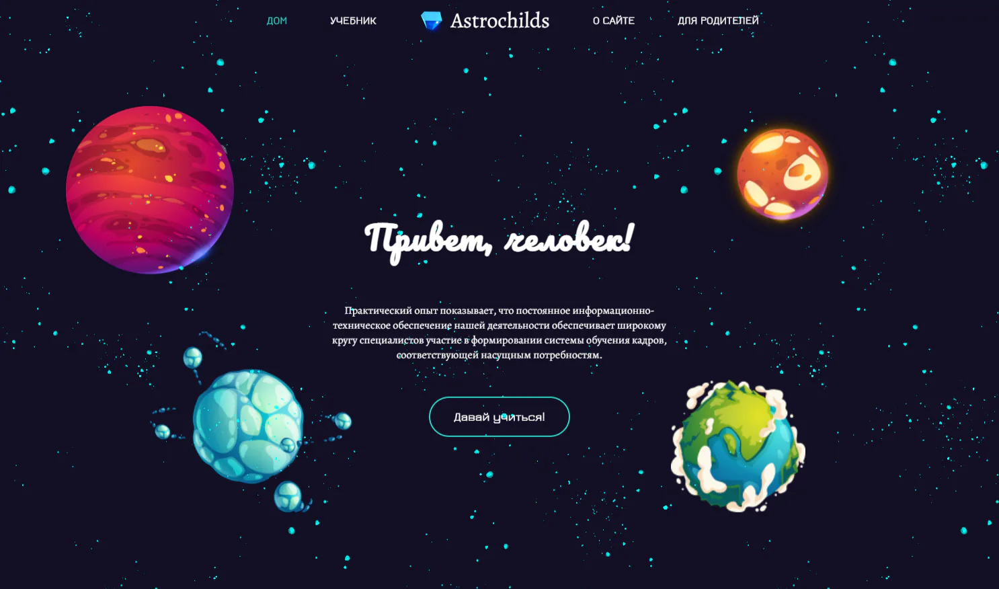

# Astrochild
🪐образец главной страницы сайта, посвященной астрономии

 

<!-- ccылка на проект -->

##⚡Описание проекта

**Год разработки**: 2022 год

**Стек**: ● HTML ● CSS ● JavaScript ● Node.js

Шуточный проект, идея которого заключалась в создании главной страницы онлайн-школы астрономии. Сайт должен был включать рекламу занятий по астрономии, призывающую обучать детей астрономии в силу актуальности данного предмета. Страница без функциональности реализована на ejs и чистом css. 

##💡Идея проекта
Идея сделать мини проект для портфолио возникла после просмотра картинок в папке на рабочем столе. Картинки были для бесплатного использования. А почему бы мне их не использовать и не собрать свой сайт? А давай на скорость? Погнали! Далее добавить шаблонный код для запуска сервера немного исправлений и вуа-ля! Так возникла данная страница.

## Требования

- npm v7.20.6
- node >= 16.13.1
- Поддерживает все современные браузеры
- Проект запускался на windows с использованием программы visual studio

## Установка

1. `npm install`
2. `node app.js`
